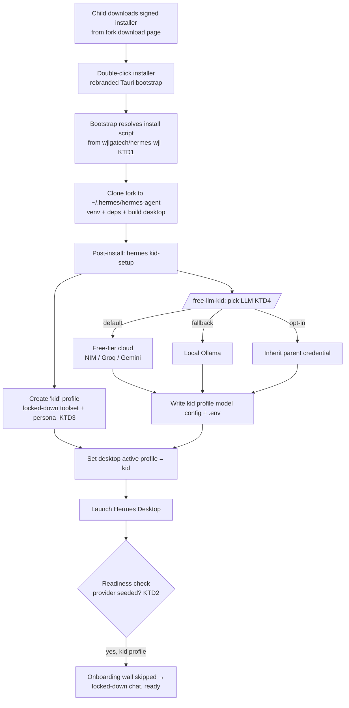
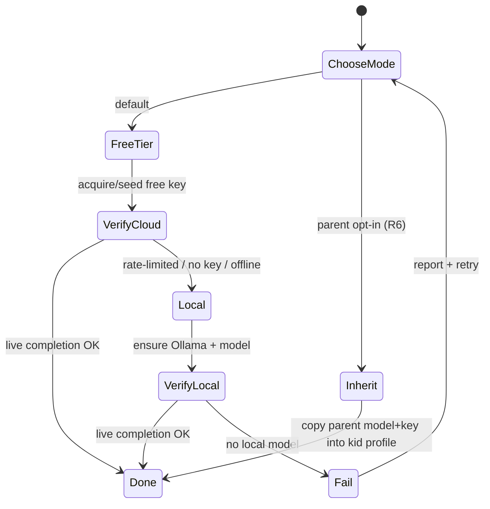

# feat: One-click kid-safe Hermes Desktop on the hermes-wjl fork

**Created:** 2026-06-14
**Type:** feat
**Depth:** Deep
**Target repo:** hermes-wjl (this fork — `wjlgatech/hermes-wjl`)

---

## Summary

Give a 10-year-old a **download-and-double-click** path to a running Hermes Desktop app that uses **this fork (`hermes-wjl`)** as its backend, lands straight in a **locked-down kid mode** (no shell/file/code tools, child-appropriate persona), and talks to a **free LLM by default** (free-tier cloud → local fallback) via a new **`/free-llm-kid`** setup — with an option to inherit the parent's credential.

Two halves: (1) **fork plumbing** — make the existing installer/update/distribution machinery point at `hermes-wjl` instead of `NousResearch/hermes-agent`, signed and hosted cross-platform; (2) **kid experience** — a pre-seeded `kid` profile that suppresses the onboarding credential wall and applies a restricted toolset + persona, wired up by `/free-llm-kid`.

Most of the kid experience reuses existing mechanisms (the `safe` toolset, `agent.disabled_toolsets`, per-profile `SOUL.md`/`config.yaml`, and the fact that a pre-seeded provider config makes the onboarding overlay never appear). The genuinely new/hard work is fork-rebranding the installer and **cross-platform code-signing/notarization**.

---

## Problem Frame

A parent wants their child to use Hermes Desktop, but the current path is unsuitable for a kid:

- **Install is upstream-locked.** The bootstrap installer, `scripts/install.sh`, and the desktop's update check all clone `github.com/NousResearch/hermes-agent` from ~9 hardcoded locations and download from `hermes-agent.nousresearch.com`. There is no fork-built, fork-hosted installer.
- **First run demands credentials.** The onboarding overlay (`apps/desktop/src/components/desktop-onboarding-overlay.tsx`) blocks the app until a provider is configured — a sign-in/API-key step a child can't complete.
- **No guardrails.** The default agent has full shell, file-mutation, browser, and code-execution tools and a generic persona — inappropriate for an unsupervised 10-year-old.
- **No free/kid-safe LLM path.** Getting a working model means an OAuth login or pasting an API key; there is no "set me up with a free model" flow.

**Goal:** the child downloads one installer, double-clicks, and is chatting with a safe assistant — no keys, no setup screens, on a backend the parent controls (this fork).

---

## Requirements

**R1.** Installation is download-and-double-click on the child's machine; no terminal use by the child. *(Install shape: downloadable installer — confirmed.)*
**R2.** The installed app uses `wjlgatech/hermes-wjl` as its backend/source and updates from the fork, not upstream.
**R3.** First launch lands directly in chat — the onboarding credential wall never appears for the kid profile.
**R4.** The agent runs in a **locked-down kid mode**: no terminal/process, no file write/patch/delete, no arbitrary browser/code-execution/delegation/cron; a child-appropriate persona; bounded turns.
**R5.** The default model is a **free LLM with a survival chain**: free-tier cloud (NVIDIA NIM / Groq / Gemini) first, automatic fallback to a **local** model (Ollama) when rate-limited/offline.
**R6.** The parent can instead choose to **inherit their own credential** into the kid profile (opt-in), with cost/abuse risk surfaced.
**R7.** A new **`/free-llm-kid`** skill performs the LLM setup (acquire/seed credentials, write the kid profile's model config, verify a live response).
**R8.** Coverage is **cross-platform** (macOS, Windows, Linux), with installers signed/notarized so the child doesn't hit Gatekeeper/SmartScreen blocks.
**R9.** The parent has clear docs: install steps, LLM options, cost/safety notes, how to review conversations, how to change the model.

---

## Key Technical Decisions

**KTD1 — Single source of fork identity; override the upstream constants once.**
Introduce one documented "brand/source" definition (repo slug, HTTPS/SSH URLs, download host, app id, product name) and replace each hardcoded `NousResearch/hermes-agent` reference with a value derived from it. The constants live in different languages (shell, Rust, JS, Python), so the "single source" is a documented constants block per language pointing at the same values, not a shared runtime import. Rationale: the fork tracks upstream (`upstream/main` merges), so concentrating overrides minimizes future merge conflicts. *(See **Risks** for the upstream-merge maintenance cost.)*

**KTD2 — Achieve zero-setup by pre-seeding a profile, not by changing onboarding logic.**
The onboarding overlay only blocks when `evaluateRuntimeReadiness()` finds no provider. Seeding `~/.hermes/profiles/kid/config.yaml` (model + base_url) and `.env` (key) and defaulting the desktop's active profile to `kid` makes the wall never render — no change to onboarding code. Rationale: smallest, least-fragile lever; reuses the documented readiness check.

**KTD3 — Build kid mode from existing toolset + persona primitives, not new gating code.**
Use the existing `safe` toolset plus `agent.disabled_toolsets: [terminal, file, browser, execute_code, delegation, cronjob]`, a per-profile `SOUL.md`, an `agent.personalities.kid` entry with `display.personality: kid`, and `agent.max_turns`. Rationale: these are first-class config keys (`toolsets.py`, `model_tools.py`, `agent/prompt_builder.py`); no new enforcement path to validate. *(Defense-in-depth note: the optional `ToolGuardrailDecision` pre-tool hook in `run_agent.py` is a follow-up hardening lever, not required for v1.)*

**KTD4 — `/free-llm-kid` is a new skill modeled on `free-llm`, writing into the kid profile.**
It implements the R5 survival chain (NVIDIA NIM via a free `build.nvidia.com` key → Groq/Gemini → local Ollama) and the R6 inherit-parent option, then writes `model` config + `.env` into `~/.hermes/profiles/kid/` and verifies a live completion. Rationale: `free-llm` already encodes the free-tier providers and fallback philosophy; the kid variant adds profile-targeting, parent-assisted key acquisition, and a no-cost default.

**KTD5 — Cross-platform signing is a hard dependency, surfaced early.**
macOS notarization (Apple Developer ID) and Windows Authenticode signing require the parent's paid accounts/certs. Without them, the child hits Gatekeeper/SmartScreen — defeating R1. Treated as an explicit prerequisite, with an unsigned-but-documented fallback path for testing. *(See **Risks & Dependencies**.)*

---

## High-Level Technical Design

End-to-end flow from the child double-clicking to a locked-down chat:



LLM selection inside `/free-llm-kid` (R5/R6 survival chain):



---

## Output Structure

New artifacts this plan introduces (fork-relative):

```
hermes-wjl/
├── branding/
│   └── fork-identity.md          # KTD1 single source: repo slug, URLs, host, appId, productName
├── skills/
│   └── free-llm-kid/
│       └── SKILL.md              # U5 new skill
├── templates/
│   └── kid-profile/              # U4 seed template for ~/.hermes/profiles/kid/
│       ├── config.yaml           # safe toolset, disabled_toolsets, personality, max_turns, model placeholder
│       └── SOUL.md               # child-appropriate persona
├── hermes_cli/
│   └── subcommands/
│       └── kid_setup.py          # U6 `hermes kid-setup` entrypoint (new)
├── docs/
│   └── kid-mode.md               # U8 parent guide
└── .github/workflows/
    └── build-sign-installers.yml # U3 cross-platform build/sign/notarize/publish (new or extended)
```

The per-unit **Files** sections remain authoritative.

---

## Implementation Units

Grouped into three phases. Phases are sequential; units within a phase follow their stated dependencies.

### Phase 1 — Fork plumbing (make `hermes-wjl` installable as itself)

### U1. Fork identity & repo redirection

**Goal:** Every install/update/clone path resolves to `wjlgatech/hermes-wjl` and the fork's download host instead of upstream.
**Requirements:** R2.
**Dependencies:** none.
**Files:**
- `branding/fork-identity.md` (new — the documented source of truth: repo slug, HTTPS/SSH URLs, download host, electron `appId`, `productName`)
- `scripts/install.sh` (REPO_URL_SSH/HTTPS at ~L46-47), `scripts/install.ps1`
- `apps/bootstrap-installer/src-tauri/src/install_script.rs` (raw-content URL ~L192)
- `apps/desktop/electron/update-remote.cjs` (`OFFICIAL_REPO_HTTPS_URL`/`OFFICIAL_REPO_CANONICAL` ~L15-16)
- `hermes_cli/main.py` (`OFFICIAL_REPO_URL(S)` ~L6229-6235), `hermes_cli/banner.py` (version-check references)
- `apps/desktop/package.json` (electron-builder `appId`, `productName` — fork identity)
- Test: `tests/test_fork_identity.py` (new)
**Approach:** Replace upstream literals with fork values sourced from `fork-identity.md`. Keep a single grep-able marker (e.g., a comment tag) at each override site so future upstream merges are easy to re-audit. Decide whether to keep upstream as a secondary update remote (default: no — fork is canonical).
**Patterns to follow:** existing constant definitions in `update-remote.cjs` and `main.py`; the install-script arg handling already in `scripts/install.sh` (`--branch`, `--commit`, `--dir`).
**Test scenarios:**
- Grep guard: assert no remaining `NousResearch/hermes-agent` clone/download literal exists in install/update code paths (allowlist docs/changelog mentions). Names input (repo tree), action (scan), expected (zero hits outside allowlist).
- `install.sh --dir <tmp>` dry-run resolves the fork HTTPS URL (mock network) — asserts the cloned remote is the fork.
- Desktop update probe (`update-remote.cjs`) targets the fork remote — unit test on the resolved URL.

### U2. Rebranded cross-platform bootstrap installer

**Goal:** The Tauri bootstrap installer is fork-branded and resolves its install script from `hermes-wjl`, buildable for mac/win/linux.
**Requirements:** R1, R2, R8.
**Dependencies:** U1.
**Files:**
- `apps/bootstrap-installer/src-tauri/tauri.conf.json` (product name, identifier, icons, window title)
- `apps/bootstrap-installer/src-tauri/src/install_script.rs` (consume U1 fork URL), `apps/bootstrap-installer/src/` (UI copy/branding)
- `apps/bootstrap-installer/src-tauri/icons/` (fork icons)
**Approach:** Rebrand identifiers and assets; confirm the installer's three script sources (dev env shortcut, bundled fallback, network) all map to the fork. Ensure macOS/Linux bare-launch = install mode still holds. No new install stages — only source + branding.
**Patterns to follow:** existing mode detection in `apps/bootstrap-installer/src-tauri/src/lib.rs`; stage orchestration in `bootstrap.rs`.
**Test scenarios:** `Test expectation: none -- branding/config rebrand.` Verification: a local `tauri build` produces a launchable fork-branded installer that, in dev mode against a local checkout, runs the install stages to completion.

### U3. Code-signing, notarization & hosting/distribution

**Goal:** Signed, notarized installers for all three OSes, published to a fork download page the child can reach.
**Requirements:** R1, R8.
**Dependencies:** U2.
**Files:**
- `.github/workflows/build-sign-installers.yml` (new or extend `.github/workflows/build-windows-installer.yml`)
- `apps/desktop/package.json` (electron-builder signing/notarize config: mac `notarize`, win `signtools`), `apps/bootstrap-installer/src-tauri/tauri.conf.json` (bundle targets)
- `website/docs/index.mdx` + a download page listing per-OS installers (replace `hermes-agent.nousresearch.com` links)
**Approach:** CI builds the desktop app (electron-builder: dmg/zip, nsis/msi, AppImage/deb/rpm) and the bootstrap installer per OS; signs (Apple Developer ID + notarize/staple; Windows Authenticode; Linux unsigned or GPG-signed repos) using secrets the parent provides; publishes to GitHub Releases; the website download page links the latest per-OS asset. Document an **unsigned local-build fallback** for testing before certs exist.
**Patterns to follow:** existing `.github/workflows/build-windows-installer.yml` (Azure signing, `tauri:build`); electron-builder targets already declared in `apps/desktop/package.json`.
**Test scenarios:** `Test expectation: none -- CI/build infra.` Verification: a release run yields a signed mac `.dmg` that opens without a Gatekeeper block on a clean machine, a signed Windows installer without SmartScreen block, and a Linux AppImage that launches; download-page links resolve to the published assets.
**Execution note:** Land the build+publish pipeline first against **unsigned** artifacts to prove the end-to-end flow, then add signing/notarization once certs are available.

### Phase 2 — Kid experience (safe, zero-setup, free LLM)

### U4. Kid profile template + locked-down "kid mode"

**Goal:** A reusable template that, when seeded as `~/.hermes/profiles/kid/`, yields a restricted toolset and child persona.
**Requirements:** R4.
**Dependencies:** none (can proceed in parallel with Phase 1).
**Files:**
- `templates/kid-profile/config.yaml` (new): `platform_toolsets`/`toolsets: [safe]`, `agent.disabled_toolsets: [terminal, file, browser, execute_code, delegation, cronjob]`, `agent.max_turns`, `agent.personalities.kid`, `display.personality: kid`, `model:` placeholder filled by U5
- `templates/kid-profile/SOUL.md` (new): child-appropriate identity
- Test: `tests/test_kid_mode.py` (new)
**Approach:** Encode the restriction with existing config keys (no new enforcement code). Optionally add a named `kid` preset to `toolsets.py` if that reads cleaner than `safe` + denylist — decide during implementation. Verify the per-profile `SOUL.md` at `~/.hermes/profiles/kid/SOUL.md` is the loaded identity (profile = its own `HERMES_HOME`).
**Patterns to follow:** `toolsets.py` `safe` preset; `agent.personalities` + `display.personality` in `cli-config.yaml.example`; `agent/prompt_builder.py` `load_soul_md()`.
**Test scenarios:**
- Resolve tool definitions for the kid config → assert `terminal`, `process`, `write_file`, `patch`, browser, `execute_code`, `delegate_task` are **absent**; `web_search`/`vision`/`image_generate` present. (Covers R4.)
- SOUL.md loading from the profile dir produces the kid identity as system-prompt slot #1.
- `max_turns` cap is honored (turn budget respected).
- Edge: a config with both `toolsets:[safe]` and a stray enable of `terminal` → denylist still wins (terminal absent).

### U5. `/free-llm-kid` skill

**Goal:** A new skill that configures a free (or inherited) LLM for the kid profile and verifies it works.
**Requirements:** R5, R6, R7.
**Dependencies:** U4.
**Files:**
- `skills/free-llm-kid/SKILL.md` (new)
- writes into `~/.hermes/profiles/kid/config.yaml` (`model.{provider,default,base_url,api_key}`) and `~/.hermes/profiles/kid/.env`
- Test: `tests/test_free_llm_kid.py` (new)
**Approach:** Implement the R5 chain — default **free-tier cloud** (NVIDIA NIM via a free `build.nvidia.com` key, or Groq/Gemini free tiers) using the existing `nvidia`/`groq`/`gemini`/`custom` providers + `base_url`; **fall back to local Ollama** (`http://127.0.0.1:11434/v1`) when no key / rate-limited / offline; **R6 inherit** copies the parent profile's `model` + key into the kid profile. End with a live completion check. Parent-assisted steps (e.g., obtaining a free NIM key) are presented to the parent, never the child.
**Patterns to follow:** the `free-llm` skill's provider/endpoint knowledge and fallback-chain philosophy; provider config shape in `hermes_cli/providers.py`, `runtime_provider.py`; persistence via `/api/model/set` + `/api/env` (or direct profile-file writes) as in `hermes_cli/web_server.py`.
**Test scenarios:**
- Free-tier success: given a NIM key, writes `provider: nvidia` + `base_url` + `.env` key into the kid profile; live-probe stub returns OK. (Covers R5, R7.)
- Fallback: no key + Ollama present → writes a `custom` Ollama `base_url`, no key. (Covers R5.)
- Inherit: parent profile has a model+key → kid profile receives a copy; parent profile untouched. (Covers R6.)
- Error: no free key and no local model → reports actionable failure, leaves no half-written config.
- Integration: after run, `evaluateRuntimeReadiness()` for the kid profile reports `configured` (provider present).

### U6. One-shot `hermes kid-setup` entrypoint

**Goal:** A single command that creates the kid profile (U4), runs `/free-llm-kid` (U5), and makes the desktop launch straight into kid mode (R3).
**Requirements:** R3, and orchestration of R4/R5.
**Dependencies:** U4, U5.
**Files:**
- `hermes_cli/subcommands/kid_setup.py` (new), registered in `hermes_cli/main.py`
- desktop active-profile default (the setting read at launch; see `apps/desktop/src/store/profile.ts` and the active-profile persistence)
- Test: `tests/hermes_cli/test_kid_setup.py` (new)
**Approach:** Seed `~/.hermes/profiles/kid/` from `templates/kid-profile/`, invoke the LLM setup, then set the desktop's active profile to `kid` so the readiness check passes and the onboarding overlay never renders (KTD2). Idempotent (re-running repairs config without duplicating).
**Patterns to follow:** `hermes_cli/profiles.py` profile creation/clone; subcommand registration in `hermes_cli/main.py`; active-profile selection in `apps/desktop/src/store/profile.ts`.
**Test scenarios:**
- Fresh run: creates `~/.hermes/profiles/kid/` with config+SOUL+model, sets active profile = kid. (Covers R3.)
- Idempotent: second run does not duplicate or clobber a working model config.
- Integration: with kid profile active, desktop readiness = configured → onboarding overlay suppressed (assert overlay gate input, not full UI).
- Error: LLM setup fails → profile still created but flagged not-ready; command exits non-zero with guidance.

### Phase 3 — Integration & docs

### U7. Installer → kid-setup integration

**Goal:** The rebranded installer runs `hermes kid-setup` as a post-install step and defaults the installed desktop to the kid profile, so the child's flow is download → double-click → locked-down chat.
**Requirements:** R1, R3.
**Dependencies:** U3, U6.
**Files:**
- `scripts/install.sh`, `scripts/install.ps1` (post-install hook to run `hermes kid-setup` when a `--kid` flag/mode is set)
- `apps/bootstrap-installer/src-tauri/src/bootstrap.rs` (add a kid-setup stage in kid-install mode)
**Approach:** Add a "kid install" path that, after the standard clone/venv/build stages, runs `hermes kid-setup`. Parent-supplied LLM choice (free-tier vs inherit) is captured once (installer prompt or a parent pre-step) and passed through. Standard (non-kid) install is unchanged.
**Patterns to follow:** existing staged flow in `bootstrap.rs`; `install.sh --include-desktop` post-clone build step.
**Test scenarios:** `Test expectation: none -- install orchestration.` Verification: a kid-mode install on a clean VM ends with the desktop launching into locked-down chat with a working free model and no onboarding screen.

### U8. Parent guide & docs sync

**Goal:** Parent-facing documentation and synced repo docs.
**Requirements:** R9.
**Dependencies:** U1–U7 (documents shipped behavior).
**Files:**
- `docs/kid-mode.md` (new): download/install per OS, LLM options (free-tier/local/inherit) with **cost & safety notes**, how to review conversations, how to switch the model, how to update.
- `apps/desktop/README.md` / `website/docs/index.mdx` (fork download links from U1/U3), `CHANGELOG.md` (`## [Unreleased]`), agent guide (`AGENTS.md`) if the kid-setup command/skill surface warrants it.
**Approach:** Write for a non-technical parent. Be explicit that kid mode reduces but does not guarantee safe LLM output — supervision still expected (ties to **Risks**).
**Test scenarios:** `Test expectation: none -- docs.` Verification: a parent can follow `docs/kid-mode.md` end-to-end without prior Hermes knowledge; links resolve to fork assets.

---

## Scope Boundaries

**In scope:** fork-redirecting install/update/distribution; signed cross-platform installers; a pre-seeded locked-down kid profile; `/free-llm-kid` with free-tier→local fallback and inherit-parent option; a `hermes kid-setup` orchestrator; parent docs.

**Deferred to Follow-Up Work:**
- Defense-in-depth `ToolGuardrailDecision` pre-tool hooks (runtime content/command blocking) beyond toolset removal.
- LLM-output content moderation / filtering layer.
- A GUI "kid setup" wizard inside the desktop app (v1 uses installer + command).
- Spend-capped or proxied parent credentials (safer inheritance than copying a raw key).
- Auto-updating the kid install in place from the fork (relies on U1's update redirection but not exercised here).

**Out of scope (this product's identity):** parental-control/MDM platform, account system, multi-child management, remote monitoring dashboards.

---

## Risks & Dependencies

**D1 — Code-signing/notarization credentials (blocking for R1/R8).** macOS needs an Apple Developer ID + notarization; Windows needs an Authenticode cert. Without them the child hits Gatekeeper/SmartScreen. *Mitigation:* land everything against unsigned artifacts first (U3 execution note); treat certs as a parent-supplied prerequisite before public distribution.

**R-cost — Inherited parent key abuse (R6).** A paid key on a child's machine can incur cost or be misused. *Mitigation:* default is free-tier (no cost); inherit is opt-in with a clear warning; spend-capped/proxied keys deferred.

**R-safety — Kid mode is best-effort.** Removing tools + a child persona reduces risk but does not guarantee age-appropriate LLM output. *Mitigation:* documentation states supervision is expected; content moderation deferred as a known gap.

**R-upstream — Fork-override maintenance.** This fork merges `upstream/main`; the U1 overrides can conflict on merges. *Mitigation:* concentrate overrides, tag each with a grep-able marker, and keep `branding/fork-identity.md` as the re-audit checklist.

**R-local — Local fallback feasibility.** Ollama fallback needs a capable machine + a (large) model download. *Mitigation:* free-tier is the default; local is the offline/ratelimited fallback, with model-size guidance in docs.

**Dep — Free-tier key acquisition.** NVIDIA NIM/Groq/Gemini free keys require a parent signup. *Mitigation:* `/free-llm-kid` presents the signup to the parent; local fallback works with no key.

---

## Alternative Approaches Considered

- **Parent-run one-line install instead of a downloadable installer.** Lighter (no signing/hosting), but fails R1's "child downloads and double-clicks." Rejected per the confirmed install-shape decision; retained conceptually as the unsigned testing fallback in U3.
- **Patch onboarding to allow a keyless start instead of pre-seeding a profile.** More invasive, diverges from upstream onboarding, higher merge risk. Rejected in favor of KTD2 (pre-seed, no logic change).
- **New runtime tool-gating layer for kid mode.** Redundant with the existing `safe` toolset + `disabled_toolsets`. Rejected for v1 (KTD3); the guardrail-hook variant is deferred as hardening.

---

## Sources & Research

- **Install/distribution map:** `apps/bootstrap-installer/src-tauri/src/{lib,bootstrap,install_script,paths}.rs`, `scripts/install.sh`/`install.ps1`, `hermes_cli/subcommands/gui.py`, `hermes_cli/main.py` (OFFICIAL_REPO_URL), `apps/desktop/electron/{main.cjs,update-remote.cjs}`, `apps/desktop/package.json` (electron-builder), `.github/workflows/build-windows-installer.yml`, `website/docs/index.mdx`. ~9 hardcoded `NousResearch/hermes-agent` / `hermes-agent.nousresearch.com` sites identified for override (U1).
- **Onboarding/credentials/profiles:** `apps/desktop/src/components/desktop-onboarding-overlay.tsx`, `apps/desktop/src/store/onboarding.ts`, `apps/desktop/src/lib/runtime-readiness.ts`, `hermes_cli/{config.py,web_server.py,providers.py,runtime_provider.py,profiles.py}`, `apps/desktop/src/store/profile.ts`. Confirmed: pre-seeding `config.yaml` + `.env` suppresses the onboarding wall; profiles are isolated `HERMES_HOME`s clonable parent→child.
- **Toolset/persona (kid mode):** `toolsets.py` (`safe` preset), `model_tools.py` (`get_tool_definitions` enabled/disabled resolution), `agent/prompt_builder.py` (`load_soul_md`), `agent/system_prompt.py`, `cli-config.yaml.example` (`agent.personalities`, `display.personality`, `disabled_toolsets`), `run_agent.py` (`ToolGuardrailDecision` — deferred hardening).
- **Free LLM:** `cli-config.yaml.example` confirms `nvidia` (NIM), `gemini`, `custom` providers with `base_url`; `/free-llm-kid` to be modeled on the `free-llm` skill (NVIDIA NIM `build.nvidia.com` free key, Groq, Gemini free tiers, local Ollama fallback).
- **External (not codebase-verified):** Apple notarization and Windows Authenticode signing requirements (KTD5/D1) — standard platform constraints; exact cert/account setup is a parent prerequisite, not yet validated against this repo's CI.
